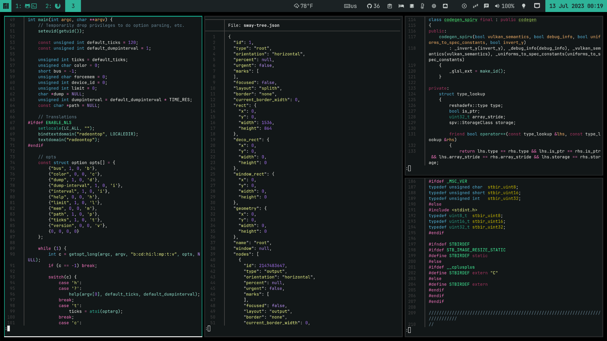

Matcha-Dark-Theme
==================

A Sublime Text / `bat` / TextMate color theme. Colors based on [Matcha-Dark GTK theme][1] colors.

Theme made to match Manjaro Sway, which uses Matcha Dark GTK theme.

---------------

### Preview



### How to install it?

#### Sublime Text

Clone the repo to the `Packages` folder of Sublime Text.

```bash
$ git clone https://github.com/trinitronx/Matcha-Dark-Theme Matcha-Dark
```

#### `bat`

Clone the repo to the `.config/bat/themes` folder for `bat`. Usually this is `$XDG_CONFIG_HOME/bat/themes` on Linux, but can also be found via: `$(bat --config-dir)/themes`.

```bash
# Create if it doesn't exist
mkdir -p "$(bat --config-dir)/themes"
cd "$(bat --config-dir)/themes"

# Download this theme in '.tmTheme' format:
git clone https://github.com/trinitronx/Matcha-Dark-Theme Matcha-Dark

# Update the binary cache
bat cache --build
```

### How to select the theme?

#### Sublime Text

Just select it from the `Preferences -> Color Scheme` Context Menu.

#### `bat`

There are a few ways to select the theme in `bat`:

Set via environment variable: `BAT_THEME`

```bash
export BAT_THEME=Matcha-Dark

bat /path/to/file
```

Select via command line flags:

```bash
bat --theme=Matcha-Dark
```

[1]: https://github.com/vinceliuice/Matcha-gtk-theme
